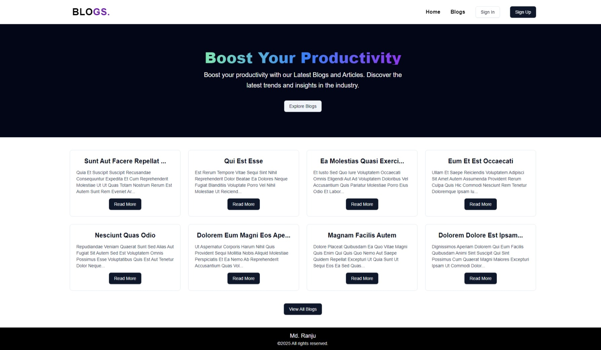
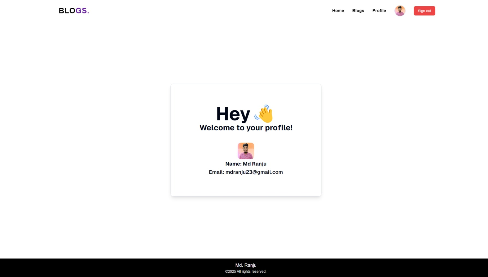
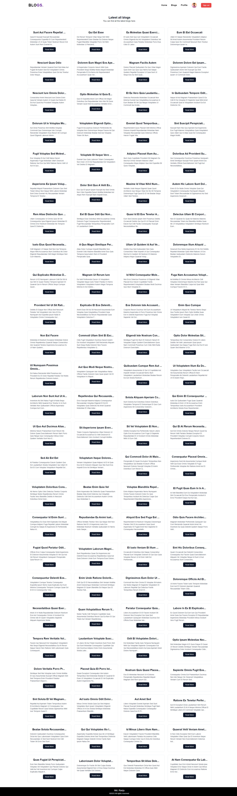

# Blog App Assessment

This is a blog application built with Next.js. The application allows users to create, edit, and delete blog posts. It also supports user authentication and authorization.

## Features

- User authentication and authorization
- View blog posts

- Responsive design
- Server-side rendering with Next.js
- API routes for handling blog operations

## Getting Started

To get started with the project, follow these steps:

### Prerequisites

- Node.js (v14 or higher)
- npm or yarn

### Installation

1. Clone the repository:

   ```bash
   git clone https://github.com/muhammadranju/blog-app-nextjs
   ```

2. Navigate to the project directory:

   ```bash
   cd blog-app-assessment
   ```

3. Install the dependencies:

   ```bash
   npm install
   # or
   yarn install
   ```

### Running the Development Server

To start the development server, run:

```bash
npm run dev
# or
yarn dev
```

Open [http://localhost:3000](http://localhost:3000) with your browser to see the application.

### Building for Production

To build the application for production, run:

```bash
npm run build
# or
yarn build
```

### Environment Variables

Create a `.env.local` file in the root of the project and add the following environment variables:

```
KINDE_CLIENT_ID=*************************
KINDE_CLIENT_SECRET=*************************
KINDE_ISSUER_URL=https://your.kinde.com
KINDE_SITE_URL=http://localhost:3000
KINDE_POST_LOGOUT_REDIRECT_URL=http://localhost:3000
KINDE_POST_LOGIN_REDIRECT_URL=http://localhost:3000

```




